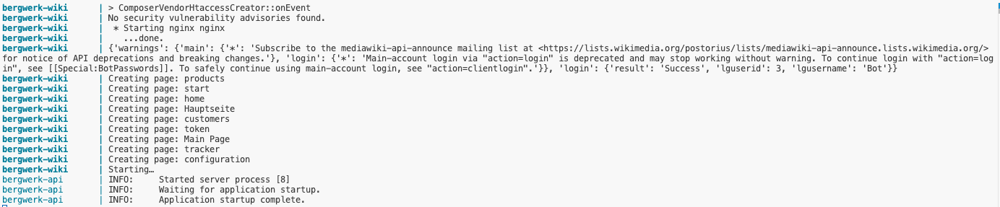
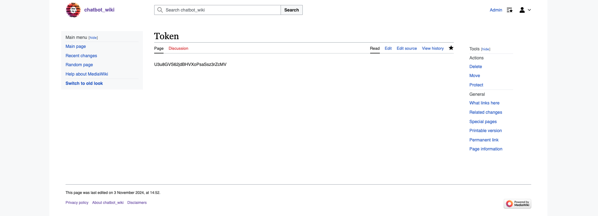

# Installation Guide

## Bergwerk Components

To fully understand the functionality of the **Bergwerk** application, it's essential to familiarize yourself with its core components:

- **wiki**: This is where the content for the chatbot is stored. It includes a structured menu and training questions for the intent classifier.
- **api**: This component allows access to the Wiki and provides import/export functionality for chatbot content, facilitating data migration.
- **api**: This adapter enables communication with the Rasa Webchat Plugin, which resides at the root of the web server.
- **Bergwerk-cron**: Responsible for automatically creating wiki pages from conversations stored in the MySQL Tracker database. These pages are saved on the wiki tracker.
- **Database (db)**: A MySQL database that stores the MediaWiki conversation tracker, among other related data.
- **Caddy**: Used as a reverse HTTP(S) proxy that serves both the Wiki and the API.

## Important Files and Configuration Settings

### `./config.env`

The `config.env` file is crucial for setting up usernames and passwords for various services, such as:

- **MediaWiki** admin and bot accounts
- **MySQL** credentials

**IMPORTANT: Use a mix of uppercase, lowercase, numbers, and special characters, at least 12 characters long. Shorter, insecure passwords may result in failed installations. Please make sure to keep these passwords secret due to the fact that it can be used to alter the contents of your chatbot.**

Additionally, you need to specify the protocol (`http` or `https`) and the hostname of your server. Bergwerk can use Let’s Encrypt to provision your server with valid SSL certificates. To enable this:

Set the `SERVER` environment variable to `https` and include your hostname. Example: `SERVER=https://chatbot.example.com`.

If you changed the server hostname from `localhost` to something else, ensure you also update it in `caddy/html/index.html` if you want to test your chatbot.

For secure communication with the MySQL component, Bergwerk automatically creates a self-signed TLS certificate. This allows secure remote access to the MySQL server. Currently, it is not possible to use a certificate from a trusted certificate authority.

### `./wiki/configuration.txt`

In this file, you can configure various settings, such as the initial greeting message for the Rasa Webchat Plugin, an error message, and the duration of the inactivity timer for conversation ratings. Most defaults should work in typical scenarios.

## Start All Containers and Access Services

After making your adjustments, it's time to start the chatbot by running the following command:

```
docker compose up
```

Wait for the services to start up, and then you can access the interactive example chatbot via `http://localhost`. This should look similar to these messages: 



The Wiki for managing chatbot content can be accessed at `http://localhost/wiki`.

## Set Admin Token in Wiki


To use the various admin functions of the Bergwerk API, you must set the admin token. You can do this by visiting the following page:
`http://localhost/wiki/w/index.php?title=Token`.

**IMPORTANT: Please make sure to keep this token a secret due to the fact that it can be used to alter the contents of your chatbot.**



The admin token can be used to access the admin endpoints of the Bergwerk API, such as 

* Import chatbot content endpoint: `http://localhost/api/admin/import/<yourtoken>/`
* Export chatbot content endpoint: `http://localhost/api/admin/export/<yourtoken>/`
* Build intent classifier endpoint: `http://localhost/api/admin/build_intent_classifier/<yourtoken>/`


Read more on these endpoints in the next chapter . 


## Building an Intent Classifier

After you filled your chatbot wiki pages with content and training questions, you might want to train your intent classifier. This makes escpecially 
sense if you want your users to use the text input field instead of the menu buttons. To build the intent classifier, send an API 'GET' request to this endpoint: 
`curl http://localhost/api/admin/build_intent_classifier/<yourtoken>/`. You can also use Bergwerk's demo content to build an intent classifier. Please note that depending on your hardware, builing an intent classifier can take quite a long time. Training the intent classifier can be resource-intensive and time-consuming, depending on the amount of content and the hardware available. For instance, if your chatbot consists of approximately 100 pages, each containing about 20 to 30 training questions, the training process may take up to two hours to complete on a 10-core M1 Pro Processor. You need at least 16 GB of RAM to train an intent classifier. 

### Backing up the Intent Classifier (and Reusing it)

You can make a backup of the intent classifier by invoking `docker cp` for now. In your bergwerk directory, 
`docker cp api:/intent_classifier api/data/` This will copy the intent classifier to the "data" directory of the Bergwerk API. 
Any intent classfier located in the "data" directory of the Bergwerk API will be automatically installed when you start your Bergwerk app via `docker compose up`.

